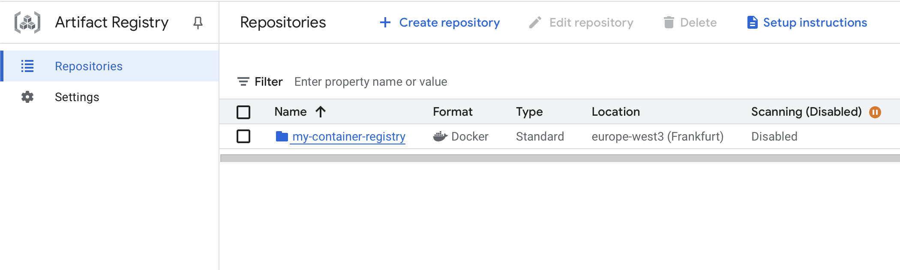

# Exam template for 02476 Machine Learning Operations

This is the report template for the exam. Please only remove the text formatted as with three dashes in front and behind
like:

```--- question 1 fill here ---```

Where you instead should add your answers. Any other changes may have unwanted consequences when your report is
auto-generated at the end of the course. For questions where you are asked to include images, start by adding the image
to the `figures` subfolder (please only use `.png`, `.jpg` or `.jpeg`) and then add the following code in your answer:

``

In addition to this markdown file, we also provide the `report.py` script that provides two utility functions:

Running:

```bash
python report.py html
```

Will generate a `.html` page of your report. After the deadline for answering this template, we will auto-scrape
everything in this `reports` folder and then use this utility to generate a `.html` page that will be your serve
as your final hand-in.

Running

```bash
python report.py check
```

Will check your answers in this template against the constraints listed for each question e.g. is your answer too
short, too long, or have you included an image when asked. For both functions to work you mustn't rename anything.
The script has two dependencies that can be installed with

```bash
pip install typer markdown
```

## Overall project checklist

The checklist is *exhaustive* which means that it includes everything that you could do on the project included in the
curriculum in this course. Therefore, we do not expect at all that you have checked all boxes at the end of the project.
The parenthesis at the end indicates what module the bullet point is related to. Please be honest in your answers, we
will check the repositories and the code to verify your answers.

### Week 1

* [x] Create a git repository (M5)
* [x] Make sure that all team members have write access to the GitHub repository (M5)
* [x] Create a dedicated environment for you project to keep track of your packages (M2)
* [x] Create the initial file structure using cookiecutter with an appropriate template (M6)
* [x] Fill out the `data.py` file such that it downloads whatever data you need and preprocesses it (if necessary) (M6)
* [x] Add a model to `model.py` and a training procedure to `train.py` and get that running (M6)
* [x] Remember to fill out the `requirements.txt` and `requirements_dev.txt` file with whatever dependencies that you
    are using (M2+M6)
* [x] Remember to comply with good coding practices (`pep8`) while doing the project (M7)
* [x] Do a bit of code typing and remember to document essential parts of your code (M7)
* [x] Setup version control for your data or part of your data (M8)
* [x] Add command line interfaces and project commands to your code where it makes sense (M9)
* [x] Construct one or multiple docker files for your code (M10)
* [x] Build the docker files locally and make sure they work as intended (M10)
* [x] Write one or multiple configurations files for your experiments (M11)
* [x] Used Hydra to load the configurations and manage your hyperparameters (M11)
* [x] Use profiling to optimize your code (M12)
* [x] Use logging to log important events in your code (M14)
* [x] Use Weights & Biases to log training progress and other important metrics/artifacts in your code (M14)
* [x] Consider running a hyperparameter optimization sweep (M14)
* [x] Use PyTorch-lightning (if applicable) to reduce the amount of boilerplate in your code (M15)

### Week 2

* [x] Write unit tests related to the data part of your code (M16)
* [x] Write unit tests related to model construction and or model training (M16)
* [x] Calculate the code coverage (M16)
* [x] Get some continuous integration running on the GitHub repository (M17)
* [x] Add caching and multi-os/python/pytorch testing to your continuous integration (M17)
* [x] Add a linting step to your continuous integration (M17)
* [x] Add pre-commit hooks to your version control setup (M18)
* [x] Add a continues workflow that triggers when data changes (M19)
* [x] Add a continues workflow that triggers when changes to the model registry is made (M19)
* [x] Create a data storage in GCP Bucket for your data and link this with your data version control setup (M21)
* [x] Create a trigger workflow for automatically building your docker images (M21)
* [x] Get your model training in GCP using either the Engine or Vertex AI (M21)
* [x] Create a FastAPI application that can do inference using your model (M22)
* [x] Deploy your model in GCP using either Functions or Run as the backend (M23)
* [x] Write API tests for your application and setup continues integration for these (M24)
* [x] Load test your application (M24)
* [x] Create a more specialized ML-deployment API using either ONNX or BentoML, or both (M25)
* [x] Create a frontend for your API (M26)

### Week 3

* [x] Check how robust your model is towards data drifting (M27)
* [x] Deploy to the cloud a drift detection API (M27)
* [x] Instrument your API with a couple of system metrics (M28)
* [x] Setup cloud monitoring of your instrumented application (M28)
* [x] Create one or more alert systems in GCP to alert you if your app is not behaving correctly (M28)
* [ ] If applicable, optimize the performance of your data loading using distributed data loading (M29)
* [ ] If applicable, optimize the performance of your training pipeline by using distributed training (M30)
* [ ] Play around with quantization, compilation and pruning for you trained models to increase inference speed (M31)

### Extra

* [ ] Write some documentation for your application (M32)
* [ ] Publish the documentation to GitHub Pages (M32)
* [ ] Revisit your initial project description. Did the project turn out as you wanted?
* [ ] Create an architectural diagram over your MLOps pipeline
* [ ] Make sure all group members have an understanding about all parts of the project
* [ ] Uploaded all your code to GitHub

## Group information

### Question 1
> **Enter the group number you signed up on <learn.inside.dtu.dk>**
>
> Answer:

NaN

### Question 2
> **Enter the study number for each member in the group**
>
> Example:
>
> *sXXXXXX, sXXXXXX, sXXXXXX*
>
> Answer:

* Ege Süalp (12806046) 
* Celal Berke Can (13030133)

### Question 3
> **A requirement to the project is that you include a third-party package not covered in the course. What framework**
> **did you choose to work with and did it help you complete the project?**
>
> Recommended answer length: 100-200 words.
>
> Example:
> *We used the third-party framework ... in our project. We used functionality ... and functionality ... from the*
> *package to do ... and ... in our project*.
>
> Answer:

* We used the Hugging Face `transformers` framework in our project, which provided us with state-of-the-art pre-trained models and utilities for natural language processing tasks. The transformers library made it straightforward to fine-tune models such as BERT and DistilBERT for sentiment analysis, allowing us to leverage powerful architectures with minimal effort. Additionally, we utilized the `evaluate` library from Hugging Face to systematically assess our model’s performance using standard metrics like accuracy and F1-score. For data management, we used the `kaggle` and `kagglehub` frameworks to programmatically download datasets from Kaggle within our codebase, rather than downloading them manually. We implemented a dedicated download function to automate this process, ensuring reproducibility and ease of setup for new team members. These frameworks and resources significantly accelerated our development process, improved reproducibility, and enabled us to focus on experimentation and deployment rather than low-level implementation details. Overall, they were essential in helping us complete the project efficiently and with high-quality results. *

## Coding environment

> In the following section we are interested in learning more about you local development environment. This includes
> how you managed dependencies, the structure of your code and how you managed code quality.

### Question 4

> **Explain how you managed dependencies in your project? Explain the process a new team member would have to go**
> **through to get an exact copy of your environment.**
>
> Recommended answer length: 100-200 words
>
> Example:
> *We used ... for managing our dependencies. The list of dependencies was auto-generated using ... . To get a*
> *complete copy of our development environment, one would have to run the following commands*
>
> Answer:

* We used conda to manage our project environments, ensuring consistency across different development machines. All required dependencies are listed in our requirements.txt and additional requirements files for development and testing. To get an exact copy of our environment, run the following in the root directory:

`conda create --name myenv python=3.12`
`conda activate myenv`
`pip install -r requirements.txt`
`pip install -r requirements_dev.txt`
`pip install -r requirements_tests.txt` *

### Question 5

> **We expect that you initialized your project using the cookiecutter template. Explain the overall structure of your**
> **code. What did you fill out? Did you deviate from the template in some way?**
>
> Recommended answer length: 100-200 words
>
> Example:
> *From the cookiecutter template we have filled out the ... , ... and ... folder. We have removed the ... folder*
> *because we did not use any ... in our project. We have added an ... folder that contains ... for running our*
> *experiments.*
>
> Answer:

* We have mainly adopted cookiecutter with MLOps template. During development, we have removed "notebook" folder and also added new ones.

Added:
 - api: A new folder for our FastAPI integration
 - cloudbuild: YAML files for GCS builds.
 - utils: Utility scripts that we used to implement ONNX and validate WANDB.
 - frontend: Streamlit implementation *

### Question 6

> **Did you implement any rules for code quality and format? What about typing and documentation? Additionally,**
> **explain with your own words why these concepts matters in larger projects.**
>
> Recommended answer length: 100-200 words.
>
> Example:
> *We used ... for linting and ... for formatting. We also used ... for typing and ... for documentation. These*
> *concepts are important in larger projects because ... . For example, typing ...*
>
> Answer:

* We implement pre-commit hooks to ensure the code linting. We also use `ruff` to check formatting issues and fix them. We also tried to follow pep8 style guide throughout the project. These concepts are even more important in larger projects to maintain code readability among collaborators and prevent any production issues. *

## Version control

> In the following section we are interested in how version control was used in your project during development to
> corporate and increase the quality of your code.

### Question 7

> **How many tests did you implement and what are they testing in your code?**
>
> Recommended answer length: 50-100 words.
>
> Example:
> *In total we have implemented X tests. Primarily we are testing ... and ... as these the most critical parts of our*
> *application but also ... .*
>
> Answer:

In total we have implemented 36 tests. Primarily we are testing data and model as these are the most critical parts of our
application. We aimed to keep our data processing and model parts as stable as possible during development. We run test on api script as well.

### Question 8

> **What is the total code coverage (in percentage) of your code? If your code had a code coverage of 100% (or close**
> **to), would you still trust it to be error free? Explain you reasoning.**
>
> Recommended answer length: 100-200 words.
>
> Example:
> *The total code coverage of code is X%, which includes all our source code. We are far from 100% coverage of our **
> *code and even if we were then...*
>
> Answer:

The average code coverage is 82%, which includes all our source code. We have relatively higher coverage in our api script (95%). In model.py and data.py the coverage is about ~74-78%. We didn't run test for util scripts and frontend since they do not constitute the main bones of the project.

Even with 100% code coverage, the code might not be error-free because coverage only indicates that the code was executed during tests, not that it was tested correctly. Tests might miss logical errors, fail to cover edge cases, or lack assertions for expected outcomes. Additionally, real-world scenarios can introduce unexpected interactions that tests didn't anticipate, making 100% coverage an incomplete measure of code reliability.

### Question 9

> **Did you workflow include using branches and pull requests? If yes, explain how. If not, explain how branches and**
> **pull request can help improve version control.**
>
> Recommended answer length: 100-200 words.
>
> Example:
> *We made use of both branches and PRs in our project. In our group, each member had an branch that they worked on in*
> *addition to the main branch. To merge code we ...*
>
> Answer:

We have created branch for each development task (modules in the project task list) and then add CI to test whether these branches are eligible to be merged with main. We solely used PRs in our project to keep our code clean. With GCS integration, we ensure that the recent build is taken in the cloud based on the updated main branch.

### Question 10

> **Did you use DVC for managing data in your project? If yes, then how did it improve your project to have version**
> **control of your data. If no, explain a case where it would be beneficial to have version control of your data.**
>
> Recommended answer length: 100-200 words.
>
> Example:
> *We did make use of DVC in the following way: ... . In the end it helped us in ... for controlling ... part of our*
> *pipeline*
>
> Answer:

We used DVC to manage our data, which is stored in a Google Cloud Storage (GCS) bucket. DVC allowed us to version control large datasets efficiently without storing them directly in the Git repository. This made it easy to track changes to our data, share consistent data versions across the team, and ensure reproducibility of our experiments. By connecting DVC with GCS, we could seamlessly pull the correct data version needed for any experiment or model training run, improving collaboration and making our workflow more robust.

### Question 11

> **Discuss you continuous integration setup. What kind of continuous integration are you running (unittesting,**
> **linting, etc.)? Do you test multiple operating systems, Python  version etc. Do you make use of caching? Feel free**
> **to insert a link to one of your GitHub actions workflow.**
>
> Recommended answer length: 200-300 words.
>
> Example:
> *We have organized our continuous integration into 3 separate files: one for doing ..., one for running ... testing*
> *and one for running ... . In particular for our ..., we used ... .An example of a triggered workflow can be seen*
> *here: <weblink>*
>
> Answer:

We have structured our continuous integration (CI) setup into multiple workflows under .github/workflows/, each targeting specific stages of our MLOps pipeline. The key workflows include:

    * Run tests: This workflow is responsible for executing our unit and integration tests. It ensures that core components of the system function correctly across development stages. We use pytest and include coverage reporting in local runs to monitor test completeness.

    * Pre-commit CI & auto-update: These workflows ensure code quality and consistency. They run linting checks (e.g., black, flake8, or ruff), verify that pre-commit hooks pass, and automatically update pre-commit dependencies when needed.

    * Evaluate on Model Registry Change: This workflow is triggered when changes are made to the model registry. It validates updated models, runs evaluation scripts, and logs performance metrics to prevent regressions.

    * Dataset Statistics on Data Change: When datasets are modified, this workflow recomputes and logs dataset statistics to monitor data drift or schema changes.

    * load_api_test.yaml: This YAML file contains a workflow to test our API layer, ensuring that endpoints correctly respond to requests and that the backend remains stable as changes are introduced.

Currently, our CI runs on Ubuntu, Windows and MacOS using Python 3.12. We do not yet test across multiple Python versions. We used caching in [test workflows](https://github.com/egesualp/lmu-mlops-ss25/actions/workflows/tests.yaml) and also in our [monthly pre-commit hook workflows](https://github.com/egesualp/lmu-mlops-ss25/actions/workflows/update_pre_commit.yaml).


## Running code and tracking experiments

> In the following section we are interested in learning more about the experimental setup for running your code and
> especially the reproducibility of your experiments.

### Question 12

> **How did you configure experiments? Did you make use of config files? Explain with coding examples of how you would**
> **run a experiment.**
>
> Recommended answer length: 50-100 words.
>
> Example:
> *We used a simple argparser, that worked in the following way: Python  my_script.py --lr 1e-3 --batch_size 25*
>
> Answer:

Experiments are configured using Hydra with YAML files located in the conf directory, such as config_hf.yaml and sweep.yaml. The train_hf.py script utilizes these configurations to manage experiment settings. To run an experiment, execute the script with Hydra, specifying the desired configuration file. For example, use python src/train_hf.py --config-name=config_hf to load config_hf.yaml. This setup allows for flexible parameter management and easy adjustments without altering the code.

### Question 13

> **Reproducibility of experiments are important. Related to the last question, how did you secure that no information**
> **is lost when running experiments and that your experiments are reproducible?**
>
> Recommended answer length: 100-200 words.
>
> Example:
> *We made use of config files. Whenever an experiment is run the following happens: ... . To reproduce an experiment*
> *one would have to do ...*
>
> Answer:

To ensure reproducibility and prevent information loss during experiments, we use Weights & Biases (wandb) and Loguru for logging. These tools capture detailed logs and metrics, allowing us to track and analyze experiments effectively. Additionally, we set random seeds for libraries like NumPy and PyTorch, ensuring consistent results across runs. This combination of logging and seeding guarantees that experiments are reproducible and all relevant data is preserved. To reproduce an experiment, one would have to run training with underlying config file.

### Question 14

> **Upload 1 to 3 screenshots that show the experiments that you have done in W&B (or another experiment tracking**
> **service of your choice). This may include loss graphs, logged images, hyperparameter sweeps etc. You can take**
> **inspiration from [this figure](figures/wandb_example.png). Explain what metrics you are tracking and why they are**
> **important.**
>
> Recommended answer length: 200-300 words + 1 to 3 screenshots.
>
> Example:
> *As seen in the first image when have tracked ... and ... which both inform us about ... in our experiments.*
> *As seen in the second image we are also tracking ... and ...*
>
> Answer:

As seen in , we conducted a series of hyperparameter sweeps using Bayesian Optimization in Weights & Biases (W&B) to optimize model evaluation performance. We tracked several key metrics that reflect both model quality and computational efficiency.

The top panel shows aggregated results across different sweep runs, including `final_eval.eval_loss`, `final_eval.eval_accuracy`, and `final_eval.eval_runtime`. These metrics are crucial: low evaluation loss paired with high accuracy suggests good generalization on unseen data, while runtime offers insights into the computational cost per evaluation—a vital factor when tuning batch sizes, learning rates, and training durations.

In the lower panel, we monitor throughput metrics such as `eval/steps_per_second` and `eval/samples_per_second`. These reveal how efficiently each model configuration processes data. While these are useful for comparison, they are less relevant in our deployment setting since we use an ONNX-optimized model for inference.

To further explore how hyperparameters affect performance, we use a parallel coordinates plot in . This visualizes the relationship between `batch_size`, `epochs`, and `final_eval.eval_accuracy`. We observe that intermediate batch sizes and higher epoch counts tend to correlate with higher accuracy.

Together, these visualizations help us balance performance and efficiency, ultimately guiding us toward the best-performing sweep configurations such as `silver-sweep-7`, `confused-sweep-6`, and `youthful-sweep-9`.

### Question 15

> **Docker is an important tool for creating containerized applications. Explain how you used docker in your**
> **experiments/project? Include how you would run your docker images and include a link to one of your docker files.**
>
> Recommended answer length: 100-200 words.
>
> Example:
> *For our project we developed several images: one for training, inference and deployment. For example to run the*
> *training docker image: `docker run trainer:latest lr=1e-3 batch_size=64`. Link to docker file: <weblink>*
>
> Answer:

In our project, Docker is used to create containerized applications for consistent and isolated environments. We have Dockerfiles for different components, such as `frontend.dockerfile`, `api.dockerfile`, and `train.dockerfile`, located in the `dockerfiles` directory. To run a Docker image, you can build it using `docker build -t <image_name> -f dockerfiles/api.dockerfile .` and then run it with `docker run <image_name>`. This ensures that our applications run smoothly across different environments. You can view one of our Dockerfiles [here](dockerfiles/api.dockerfile).

### Question 16

> **When running into bugs while trying to run your experiments, how did you perform debugging? Additionally, did you**
> **try to profile your code or do you think it is already perfect?**
>
> Recommended answer length: 100-200 words.
>
> Example:
> *Debugging method was dependent on group member. Some just used ... and others used ... . We did a single profiling*
> *run of our main code at some point that showed ...*
>
> Answer:

We primarily used the VSCode Debugger for step-by-step debugging, along with loguru logging and occasional try–raise blocks to quickly isolate bugs. For profiling, we experimented with both cProfile (visualized via SnakeViz) and torch.profiler integrated with TensorBoard. This gave us useful insights into runtime behavior. However, since much of our pipeline is built on HuggingFace’s transformers library — which is already well-optimized — we did not pursue aggressive performance tuning beyond basic profiling.

## Working in the cloud

> In the following section we would like to know more about your experience when developing in the cloud.

### Question 17

> **List all the GCP services that you made use of in your project and shortly explain what each service does?**
>
> Recommended answer length: 50-200 words.
>
> Example:
> *We used the following two services: Engine and Bucket. Engine is used for... and Bucket is used for...*
>
> Answer:

We used the following six GCP services: Artifact Registry, Cloud Storage, Secret Manager, Vertex AI, Cloud Run, and Cloud Build.<br>
<br>
**Artifact Registry** is used for storing and managing Docker container images at `europe-west3-docker.pkg.dev/mlops-465916/my-container-registry/`, hosting our training, API, and monitoring container images for deployment. <br>
<br>
**Cloud Storage** serves multiple purposes: DVC remote storage at `gs://mlops-financial-sentiment/data` for data versioning, prediction data storage in sentiment-prediction-data bucket for monitoring, and training data storage in `mlops-project-bucket1` for the monitoring service to access historical data.<br>
<br>
**Secret Manager** is used for securely storing sensitive information like the `WANDB API` key, referenced in our Vertex AI and Cloud Run configurations via `secretKeyRef` to avoid exposing secrets in code. <br>
<br>
**Vertex AI** handles our model training infrastructure through custom jobs defined in `vertex_config.yaml` and `vertex_sweep_config.yaml`, enabling scalable distributed training and hyperparameter optimization sweeps on Google's managed ML platform. <br>
<br> 
**Cloud Run** provides serverless deployment for our FastAPI-based sentiment analysis API and monitoring service, with auto-scaling capabilities and integrated Prometheus monitoring through sidecar containers as configured in `cloudrun_monitoring.yaml`. We have also deployed our frontend using Cloud Run. <br>
<br> 
**Cloud Build** orchestrates our CI/CD pipeline with multiple build configurations (`build_api_docker_image.yaml`, `build_docker_images.yaml`, `build_monitoring_docker_image.yaml`) that automatically build and deploy our services when code changes are pushed to the main branch. <br>
'
### Question 18

> **The backbone of GCP is the Compute engine. Explained how you made use of this service and what type of VMs**
> **you used?**
>
> Recommended answer length: 100-200 words.
>
> Example:
> *We used the compute engine to run our ... . We used instances with the following hardware: ... and we started the*
> *using a custom container: ...*
>
> Answer:

We used Compute Engine indirectly through Vertex AI for our model training workloads rather than directly managing VMs. Our training jobs run on n1-standard-8 instances as specified in both `vertex_config.yaml` and `vertex_sweep_config.yaml` configurations. These are 8-vCPU machines with 30GB of memory, providing sufficient computational power for fine-tuning BERT models on financial sentiment data. <br> <br>
We started the training using a custom container hosted at `europe-west3-docker.pkg.dev/mlops-465916/my-container-registry/mlops-train:latest`, which includes our complete training environment with PyTorch, Transformers, and all dependencies. The containerized approach ensures consistent execution environments across different training runs and hyperparameter sweeps. <br> <br>
The Vertex AI service abstracts away the Compute Engine management, automatically provisioning and de-provisioning VM instances based on our job requirements. This approach provides the scalability benefits of Compute Engine while eliminating the operational overhead of manual VM management, making it ideal for our MLOps training workflows where we need reliable, repeatable model training at scale. <br> 

### Question 19

> **Insert 1-2 images of your GCP bucket, such that we can see what data you have stored in it.**
> **You can take inspiration from [this figure](figures/bucket_example.png).**
>
> Answer:

 <br>


### Question 20

> **Upload 1-2 images of your GCP artifact registry, such that we can see the different docker images that you have**
> **stored. You can take inspiration from [this figure](figures/registry_example.png).**
>
> Answer:

 <br>


### Question 21

> **Upload 1-2 images of your GCP cloud build history, so we can see the history of the images that have been build in**
> **your project. You can take inspiration from [this figure](figures/build_example.png).**
>
> Answer:


### Question 22

> **Did you manage to train your model in the cloud using either the Engine or Vertex AI? If yes, explain how you did**
> **it. If not, describe why.**
>
> Recommended answer length: 100-200 words.
>
> Example:
> *We managed to train our model in the cloud using the Engine. We did this by ... . The reason we choose the Engine*
> *was because ...*
>
> Answer:

We successfully managed to train our model in the cloud using Vertex AI. We implemented this through custom training jobs defined in `vertex_config.yaml` and `vertex_sweep_config.yaml` configurations.
We containerized our training environment using the `train.dockerfile`, which packages our complete ML pipeline including PyTorch, Transformers, and all dependencies into a Docker image stored in Artifact Registry at `europe-west3-docker.pkg.dev/mlops-465916/my-container-registry/mlops-train:latest`
We chose Vertex AI over direct Compute Engine because it provides managed ML infrastructure with automatic scaling, integrated experiment tracking, and seamless container orchestration. The service handles VM provisioning/de-provisioning automatically,

## Deployment

### Question 23

> **Did you manage to write an API for your model? If yes, explain how you did it and if you did anything special. If**
> **not, explain how you would do it.**
>
> Recommended answer length: 100-200 words.
>
> Example:
> *We did manage to write an API for our model. We used FastAPI to do this. We did this by ... . We also added ...*
> *to the API to make it more ...*
>
> Answer:

We successfully managed to write an API for our model using FastAPI. We implemented this in api/main.py with several production-ready features. <br>
Our API loads ONNX-optimized models from WandB artifacts for faster inference, automatically downloading the latest model version at startup. The main endpoint /predict accepts text input and returns sentiment predictions with confidence scores using Pydantic models for request/response validation. <br>
We added several special production features: Prometheus metrics integration for monitoring request latency, error rates, and throughput; automatic prediction logging to Cloud Storage for model monitoring and data collection; background tasks for non-blocking operations; and a health check endpoint for deployment monitoring. <br>
The API is containerized using api.dockerfile and deployed on Google Cloud Run with auto-scaling capabilities. We implemented a sidecar container architecture with Prometheus metric collection as defined in cloudrun_monitoring.yaml, enabling comprehensive application monitoring. <br>
Additionally, we created a separate monitoring service (sentiment_monitoring.py) that uses Evidently AI for data drift detection by comparing incoming predictions against training data stored in Cloud Storage. The entire setup includes Secret Manager integration for secure API key management and a Streamlit frontend for user interaction, creating a complete end-to-end ML serving solution.

### Question 24

> **Did you manage to deploy your API, either in locally or cloud? If not, describe why. If yes, describe how and**
> **preferably how you invoke your deployed service?**
>
> Recommended answer length: 100-200 words.
>
> Example:
> *For deployment we wrapped our model into application using ... . We first tried locally serving the model, which*
> *worked. Afterwards we deployed it in the cloud, using ... . To invoke the service an user would call*
> *`curl -X POST -F "file=@file.json"<weburl>`*
>
> Answer:

We successfully managed to deploy our API both locally and in the cloud using Google Cloud Run.
For deployment, we wrapped our model into a FastAPI application (api/main.py) containerized with Docker. We first tested locally by building the container using dockerfiles/api.dockerfile and running it with docker run, which worked successfully for development and testing. <br> <br>
For cloud deployment, we used Google Cloud Run as a serverless platform. Our deployment is automated through Cloud Build pipelines defined in build_api_docker_image.yaml, which builds the container image, pushes it to Artifact Registry, and deploys it also using the cloudrun_monitoring.yaml configuration with auto-scaling and monitoring capabilities. <br> <br>
Our live API is accessible at: https://financial-sentiment-api-687370715419.europe-west3.run.app
To invoke the service, users can call: <br>
`curl -X POST "https://financial-sentiment-api-687370715419.europe-west3.run.app/predict" \
     -H "Content-Type: application/json" \
     -d '{"text": "The company reported strong quarterly earnings"}'` <br>
We also deployed a Streamlit frontend at https://frontend-891096115648.europe-west1.run.app/ that provides a user-friendly web interface for interacting with the API.

### Question 25

> **Did you perform any unit testing and load testing of your API? If yes, explain how you did it and what results for**
> **the load testing did you get. If not, explain how you would do it.**
>
> Recommended answer length: 100-200 words.
>
> Example:
> *For unit testing we used ... and for load testing we used ... . The results of the load testing showed that ...*
> *before the service crashed.*
>
> Answer:

We performed both unit testing and load testing of our API. <br> <br>
For unit testing, we used FastAPI's TestClient in `tests/test_api.py`. Our tests verify the root endpoint returns the correct welcome message and the /predict endpoint properly accepts financial text input and returns valid sentiment predictions with labels and confidence scores. We integrated these tests into our GitHub Actions CI/CD pipeline through tests.yaml to ensure code quality on every commit. <br> <br>
For load testing, we used Locust with a custom test file `tests/locustfile.py` that simulates realistic user behavior. The load test randomly selects from financial text samples like "The company's profits increased this quarter" and "Stock prices fell sharply after the announcement" to test prediction performance under load. <br> <br>
Our automated load testing runs through GitHub Actions `load_api_test.yaml` with the following configuration:
50 concurrent users
5 users spawned per second
5-minute test duration
Tests against our live API
The results showed our Cloud Run deployment successfully handled the concurrent load without crashes, benefiting from auto-scaling capabilities. Locust results are automatically collected and stored as artifacts for performance analysis and monitoring API responsiveness under various load conditions.

### Question 26

> **Did you manage to implement monitoring of your deployed model? If yes, explain how it works. If not, explain how**
> **monitoring would help the longevity of your application.**
>
> Recommended answer length: 100-200 words.
>
> Example:
> *We did not manage to implement monitoring. We would like to have monitoring implemented such that over time we could*
> *measure ... and ... that would inform us about this ... behaviour of our application.*
>
> Answer:

We successfully implemented monitoring of our deployed FastAPI-based model using Prometheus and Google Cloud Monitoring. We instrumented our application with custom metrics using the prometheus_client library and exposed them via a /metrics endpoint. These metrics include the number of prediction requests, prediction errors, review lengths, and model latency.

We configured Cloud Run to use a Prometheus sidecar container (cloud-run-gmp-sidecar) that scrapes the /metrics endpoint and forwards the metrics to Google Cloud Monitoring. This setup was defined in our cloudrun_monitoring.yaml file, which specifies container dependencies and memory limits for both the FastAPI app and the sidecar.

Monitoring helps us observe the live behavior of the application and quickly detect anomalies, such as increased latency or error rates. We have also set an alerting system using GCS.

## Overall discussion of project

> In the following section we would like you to think about the general structure of your project.

### Question 27

> **How many credits did you end up using during the project and what service was most expensive? In general what do**
> **you think about working in the cloud?**
>
> Recommended answer length: 100-200 words.
>
> Example:
> *Group member 1 used ..., Group member 2 used ..., in total ... credits was spend during development. The service*
> *costing the most was ... due to ... . Working in the cloud was ...*
>
> Answer:

Group member 1 (Ege Süalp) and Group member 2 (Celal Berke Can) used approximately ~10 euro credits in total during the development of this MLOps project on Google Cloud Platform. <br><br>

The service costing the most was Vertex AI due to the compute-intensive model training workloads. Training BERT models for financial sentiment analysis required n1-standard-8 instances running for extended periods, especially during hyperparameter sweeps. The underlying Compute Engine instances consumed the bulk of our credits since transformer model fine-tuning is computationally expensive. Secondary costs came from Artifact Registry for storing multiple Docker images and Cloud Run for API hosting, though these were minimal due to serverless pricing. <br><br>

Working in the cloud was highly beneficial for our MLOps pipeline. It provided automatic scaling, managed infrastructure, and seamless integration between services without manual VM management. The pay-as-you-use model was cost-effective for our project scope, and services like Secret Manager and Cloud Build eliminated security and deployment complexities. <br><br>

### Question 28

> **Did you implement anything extra in your project that is not covered by other questions? Maybe you implemented**
> **a frontend for your API, use extra version control features, a drift detection service, a kubernetes cluster etc.**
> **If yes, explain what you did and why.**
>
> Recommended answer length: 0-200 words.
>
> Example:
> *We implemented a frontend for our API. We did this because we wanted to show the user ... . The frontend was*
> *implemented using ...*
>
> Answer:

**Drift Detection System** <br>
We implemented a comprehensive drift detection service in `sentiment_monitoring.py` using Evidently AI. This service continuously monitors our deployed model for data drift and performance degradation by comparing incoming prediction requests against our original training data stored in Cloud Storage `mlops-project-bucket1`. The system generates drift reports that track target drift and text evaluation metrics, helping us detect when the model's input distribution changes and when retraining might be necessary. This is crucial for maintaining model performance in production as financial language and sentiment patterns evolve over time.<br><br>
**Streamlit Frontend Application**<br><br>
We created a user-friendly Streamlit web application `frontend/app.py` deployed on Cloud Run at https://frontend-891096115648.europe-west1.run.app/. The frontend provides an intuitive interface where users can input financial text and receive real-time sentiment predictions. It connects to our FastAPI backend, displays prediction confidence scores.<br><br>


We implemented these features because they complete the MLOps cycle - the drift detection ensures long-term model reliability, while the frontend makes our ML service accessible to non-technical users, demonstrating a production-ready end-to-end solution rather than just a technical proof-of-concept.


### Question 29

> **Include a figure that describes the overall architecture of your system and what services that you make use of.**
> **You can take inspiration from [this figure](figures/overview.png). Additionally, in your own words, explain the**
> **overall steps in figure.**
>
> Recommended answer length: 200-400 words
>
> Example:
>
> *The starting point of the diagram is our local setup, where we integrated ... and ... and ... into our code.*
> *Whenever we commit code and push to GitHub, it auto triggers ... and ... . From there the diagram shows ...*
>
> Answer:


### Question 30

> **Discuss the overall struggles of the project. Where did you spend most time and what did you do to overcome these**
> **challenges?**
>
> Recommended answer length: 200-400 words.
>
> Example:
> *The biggest challenges in the project was using ... tool to do ... . The reason for this was ...*
>
> Answer:

* The biggest challenge in the project was working with Google Cloud Platform (GCP). The web UI was often slow and resource-intensive, especially on consumer-grade laptops, which made navigation and configuration frustrating at times. Beyond performance, the UI is also quite complex and unintuitive in certain areas, particularly when managing services like Artifact Registry, Cloud Run, and IAM roles.

* Collaborating as a team added another layer of difficulty due to the permissions model. Granting and requesting the right level of access often became a bottleneck, especially when dealing with service accounts or trying to push images and deploy services.

* Another major hurdle was setting up GitHub workflows. The initial setup phase was filled with cryptic errors that required trial and error to resolve. Configuring secrets, aligning paths, and ensuring the workflows triggered correctly took significant time. Despite these issues, the experience gave us a deep dive into CI/CD best practices, and we ultimately succeeded in making our workflow reliable and automated.

### Question 31

> **State the individual contributions of each team member. This is required information from DTU, because we need to**
> **make sure all members contributed actively to the project. Additionally, state if/how you have used generative AI**
> **tools in your project.**
>
> Recommended answer length: 50-300 words.
>
> Example:
> *Student sXXXXXX was in charge of developing of setting up the initial cookie cutter project and developing of the*
> *docker containers for training our applications.*
> *Student sXXXXXX was in charge of training our models in the cloud and deploying them afterwards.*
> *All members contributed to code by...*
> *We have used ChatGPT to help debug our code. Additionally, we used GitHub Copilot to help write some of our code.*
> Answer:

* Ege Süalp was in charge of:
    - Repository & Development Workflow Management: Initialized and maintained the GitHub repository, implemented pre-commit hooks, enforced PEP8 standards, and set up CI pipelines with caching, multi-OS testing, and linting steps. Also managed secret keys and created workflows for data-driven automation.<br><br>

    - Model Development & Evaluation: Developed the full machine learning pipeline including data preprocessing, model training using PyTorch Lightning and Hugging Face, evaluation scripts, and dataset validation metrics using Hydra-configured scripts and CLI interfaces.<br><br>

    - Containerization & Deployment: Built Dockerfiles for training and inference, profiled code performance, and optimized builds. Deployed the frontend (Streamlit) and backend (FastAPI) services to Cloud Run with ONNX-based model serving.<br><br>

    - Monitoring & Observability: Integrated Prometheus-based custom system metrics into the FastAPI backend and configured Google Cloud Monitoring with the sidecar pattern to enable container-level metric collection and visualization.

* Celal Berke Can was in charge of:
    - Docker Containerization & Cloud Training: Developed Docker containers for training and created all Google Cloud integrations including Vertex AI configurations to enable scalable model training in the cloud <br>
    
    - API Development & Cloud Deployment: Built the FastAPI inference service, prediction endpoints, plus created Cloud Run deployment configurations<br><br>

    - Cloud Infrastructure Management: Maintained Google Cloud logging systems, managed Cloud Build pipelines,and handled various automation tasks including Secret Manager integration for secure API key management

    - Data Drift Detection System: Implemented the drift monitoring service using Evidently AI with Cloud Storage.<br><br>

    - Hyperparameter Optimization: Configured WandB sweep implementations for automated hyperparameter tuning with Bayesian optimization.

* Common tasks:
    - Codebase Maintenance & Testing: Continuously maintained and tested the entire codebase regularly to fix bugs, improve code quality, optimize performance, and enhance project structure including refactoring configurations, updating dependencies.
